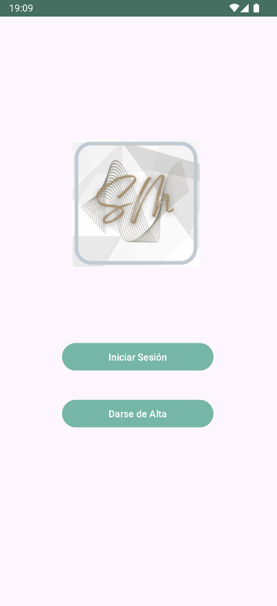
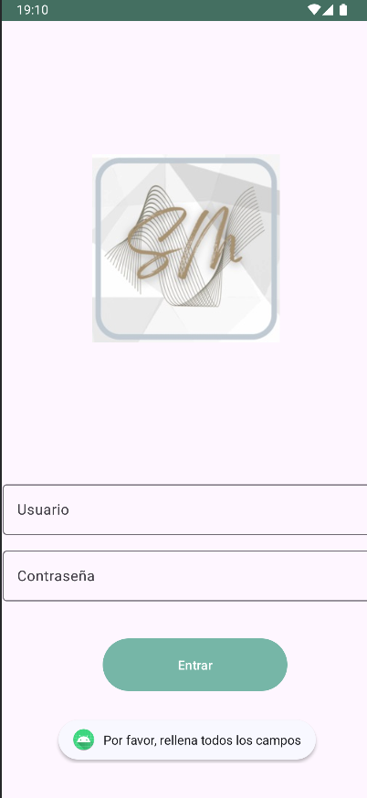
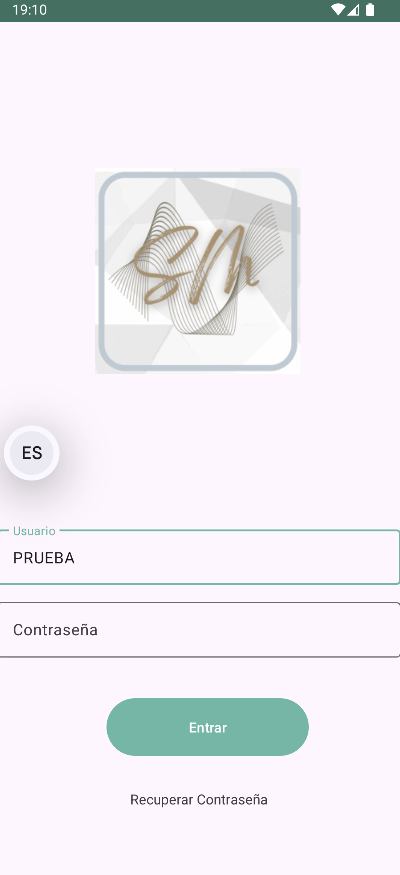

## Sara Martínez  &nbsp;&nbsp;&nbsp;&nbsp; 2DAM
https://github.com/Saykek/FitFusionAPP.git

# FITFUSIONapp

<!-- TOC -->

- [FITFUSIONapp](#fitfusionapp)
  - [1. Contexto de la aplicación](#1-contexto-de-la-aplicación)
  - [2. Requisitos](#2-requisitos)
    - [Requisitos Funcionales](#requisitos-funcionales)
    - [Requisitos No Funcionales](#requisitos-no-funcionales)
  - [3. Historias de usuario de la aplicación](#3-historias-de-usuario-de-la-aplicación)
  - [4. Prototipo, diseño y diagrama de navegación](#4-prototipo-diseño-y-diagrama-de-navegación)
    - [1. Activity Main Activity:](#1-activity-main-activity)
    - [2. Activity Inicio Sesión](#2-activity-inicio-sesión)
    - [3. Activity Menú Principal](#3-activity-menú-principal)
    - [4. Activity Mi Actividad](#4-activity-mi-actividad)
    - [5. Activity Entrenamiento](#5-activity-entrenamiento)
    - [6. Activity Clases](#6-activity-clases)
    - [7. Activity Datos Físicos](#7-activity-datos-físicos)
    - [8. Activity Nutrición](#8-activity-nutrición)
  - [9. Capturas de la ejecución de la funcionalidad](#9-capturas-de-la-ejecución-de-la-funcionalidad)
  - [10. Información técnica](#10-información-técnica)
  - [11. Innovaciones y problemas](#11-innovaciones-y-problemas)
  - [12. Conclusiones](#12-conclusiones)
  - [13. Funcionalidad a probar](#13-funcionalidad-a-probar)

## 1. Contexto de la aplicación

FitFusionApp es una aplicación diseñada para ayudar a los usuarios a mejorar su salud y bienestar a través de planes y consejos de entrenamiento y nutrición. La aplicación está dirigida a personas interesadas en mantener un estilo de vida activo, ya sean principiantes o deportistas avanzados. La aplicación esta diseñada para facilitar la realización de deporte ya que integra diferentes modalidades de ejercicio adecuándose a cada estilo de vida y podrá combinarse con una alimentación sana. Los usuarios tendrán a su disposición los horarios de las actividades guiadas pudiendo reservarlas con antelación, los menús semanales junto con sus recetas, ejercicios según el tipo de deporte que quieras en cada momento...

## 2. Requisitos

### Requisitos Funcionales

- **Registro y gestión de usuarios**
 &nbsp;&nbsp;&nbsp;&nbsp;Los usuarios podrán registrarse, iniciar sesión, gestionar su perfil y sus membresías.

- **Gestión de Clases**
 &nbsp;&nbsp;&nbsp;&nbsp;Los usuarios podrán ver y reservar clases con antelación a su realización.

 - **Gestión de Membresías**
 &nbsp;&nbsp;&nbsp;&nbsp;Los usuarios podrán elegir y suscribirse a diferentes planes de membresía, podrán también darse de baja, verán el vencimiento...

 - **Planificación de Entrenamientos**
 &nbsp;&nbsp;&nbsp;&nbsp;Se podrán elegir los entrenamientos dependiendo de lo que se quiera conseguir ( perdida de grasa, ganancia de masa muscular, mantenimiento...). También estará la opción de elegir los entrenamientos dependiendo de los grupos musculares que se quieran trabajar, y si si el usuario los realizará en casa o en el gimnasio.

 - **Gestión de Cobros**
 &nbsp;&nbsp;&nbsp;&nbsp;Se integrará el pago a las membresías, se podrán contratar servicios adicionales, el historial de pago...

 - **Notificaciones y Recordatorios**
 &nbsp;&nbsp;&nbsp;&nbsp;Se notificará cuando se acerque la fecha de caducidad de la membresía , la clase a la que se haya inscrito, el ingreso de nuevos menús, entrenamientos...

 - **Estadisticas y Seguimiento**
 &nbsp;&nbsp;&nbsp;&nbsp;Los usuarios podrán ver su progreso introduciendo sus datos físicos y a través de las estadísticas hacerse una idea del progreso, podrán llevar un seguimiento de su entrenamiento. 

### Requisitos No Funcionales

- **Seguridad**
 &nbsp;&nbsp;&nbsp;&nbsp;La aplicación tendrá deberá ser segura para los usuarios. Deberán encriptarse cualquier dato sensible referente a contraseñas, pagos...

 - **Usabilidad**
 &nbsp;&nbsp;&nbsp;&nbsp;Es una aplicación sencilla pero con multitud de opciones que podrá entender cualquier tipo de usuario, será accesible desde móvil, tablet...

 - **Escabilidad**
 &nbsp;&nbsp;&nbsp;&nbsp;Es capaz de poder gestionar cualquier número de usuarios según vaya creciendo el gimnasio, se podrá ir ampliando todo el tema de nutrición con planes personalizados y adecuados al tipo de entrenamiento elegido.

## 3. Historias de usuario de la aplicación

- **Historia usuario 1:**
&nbsp;&nbsp;&nbsp;&nbsp;Como usuario, deseo gestionar mi perfil de manera autónoma para personalizar la aplicación según mis necesidades y estilo de vida.

- **Historia usuario 2:**
&nbsp;&nbsp;&nbsp;&nbsp;Como usuario, quiero acceder rápidamente a los ejercicios para optimizar mi tiempo y mejorar mi experiencia de entrenamiento.

- **Historia usuario 3:**
&nbsp;&nbsp;&nbsp;&nbsp;Como usuario, necesito reservar clases de forma autónoma para organizar mi agenda con mayor flexibilidad y comodidad.

## 4. Prototipo, diseño y diagrama de navegación

&nbsp;&nbsp;&nbsp;&nbsp;Este es el prototipo las activity´s, he querido mostrar como sería la navegación entre ellas, aunque tendría que haber diferenciado cual era activity y cual un fragmento, pero lo cuento más adelante con más detenimiento. En el apartado de cada se verán las activity´s originales y si no están en su defecto se vera el prototipo.

- 

- 
&nbsp;&nbsp;&nbsp;&nbsp;Al iniciar la aplicación nos pedirá permiso para poder hacer uso de la cámara.

### 1. Activity Main Activity:

&nbsp;&nbsp;&nbsp;&nbsp;Mostrará dos botones, uno para iniciar sesión y otro para darse de alta.

### 2. Activity Inicio Sesión 
 

   &nbsp;&nbsp;&nbsp;&nbsp;Se podrá iniciar sesión introduciendo usuario y contraseña o bien recuperar la contraseña.Si no metemos ningún dato no nos dejará entrar.

### 3. Activity Menú Principal 
  
   &nbsp;&nbsp;&nbsp;&nbsp;En esta activity se gestionará el perfil del usuario, pudiendo modificar foto de perfil, datos personales...  
   Se podrá modificar la membresía (estado, fecha de vencimiento...). 
   &nbsp;&nbsp;&nbsp;&nbsp;En la toolbar se muestra una frase de ánimo y un botón que nos mostrará el tiempo del día.

   - 

   Consta de 5 botones:  

   - **Mi Actividad**  

     - Aquí se registrarán todos los datos relativos a las actividades realizadas.  
     - Contará con un resumen, pasos dados al día, sesiones de ejercicio realizado, distancia recorrida.  
     - Se podrá personalizar.

   - **Entrenamiento**  
     - Nos redirigirá a la activity de entrenamientos.  
     - Permitirá elegir qué tipo de ejercicio queremos realizar.

   - **Clases**  
     - Nos redirigirá a la activity de clases.  
     - Mostrará un calendario con las diferentes clases y sus horarios.

   - **Datos Físicos**  
     - Nos redirigirá a la activity donde el usuario podrá introducir sus datos físicos.

   - **Nutrición**  
     - Nos redirigirá a la activity donde el usuario podrá gestionar su alimentación.

### 4. Activity Mi Actividad 
  -   
   &nbsp;&nbsp;&nbsp;&nbsp;En esta activity se mostrarán diferentes anillos donde se resumirá la actividad realizada, se mostrará en un "cardview" las opciones personalizadas que haya elegido el usuario como, pasos, sesiones, distancia, recorrido...
### 5. Activity Entrenamiento 
 
 

   &nbsp;&nbsp;&nbsp;&nbsp;En esta activity se mostrará a través de un spinner  la forma de mostrar las diferentes modalidades ( Por objetivo, tiempo, rutinas, en casa... ), una vez elegida saldrá en un "gridview" los diferentes deportes ( fuerza, cardio, resistencia...)y a su vez se podrá elegir un deporte (en el caso de no estar disponible nos lo indicará) y se mostrarán en un "recyclerview"los diferentes ejercicios asociados a ese deporte.Se incluirá el nombre, descripción,la información para la realización, foto e incluso videos de como realizarlos. Todo esto organizado en diferentes fragmentos, ya que se pueden reutilizar fácilmente. 
### 6. Activity Clases 
  
   &nbsp;&nbsp;&nbsp;&nbsp;En esta activity se podrá acceder al horario de las clases, el usuario podrá elegir o bien por actividad, o por dia en un calendario.
### 7. Activity Datos Físicos  
   &nbsp;&nbsp;&nbsp;&nbsp;En esta activity el usuario podrá acceder a todos sus datos físicos, habrá un spinner para elegir:
   - **Peso:**  
      
     - Se podrá registrar el peso, se mostrará el peso de inicio, el actual y el objetivo a conseguir.
     - Nos mostrará un resumen del progreso, pudiendo editar en cuanto tiempo queremos llegar a nuestro peso objetivo.
     - Se incluirán gráficas de la progresión. 
   - **Medidas:** 
     
     - Se podrán registrar las medidas de las partes del cuerpo como brazo, pierna, abdomen... 
   - **Fotos:** 
      
     - Se podrán incluir fotos para poder ver el progreso.
  
### 8. Activity Nutrición 
  
   En esta activity el usuario podrá acceder a todo lo relativo con la nutrición:
     
   Consta de 3 botones:  

   - **Menús**  

     - Podremos elegir por mes (en un spinner) y se nos mostrarán las 4 semanas, al elegir la semana se nos mostrará un pdf con el menú de esa semana.  
     - Los menús se irán habilitando según llegue la semana, sino saldrá no disponible.
     - Tendrá un botón para añadir elementos a la lista de la compra.
   - **Recetario**  
    
     - Tendrá el mismo formato que menús y al seleccionar el mes y la semana se abrirá en un recyclerview todas las recetas del menú correspondiente.  
     - Tendrá un botón para añadir elementos a la lista de la compra. 
   - **Lista de la compra**  
      
     - Se mostrará la lista de elementos que se hayan ido añadiendo, ya sea desde menús o desde recetario.
     - Se podrán añadir, modificar y eliminar elementos nuevos

## 9. Capturas de la ejecución de la funcionalidad

## 10. Información técnica
- **Versión Android utilizada**  
     - Android Studio Koala Feature Drop | 2024.1.2
     - API 31 (Android 12)
     - Probado en Medium Phone API 35.
- **Emulador y dispositivos de prueba**  
     - Emulador configurado en AVD Manager
     - Probado en dispositivos virtuales como Medium Phone API 35.
- **Software necesario para la ejecución**  
     - *Android Studio:*  Koala Feature Drop | 2024.1.2
     - *Build:* AI-241.18034.62.2412.12266719, built on August 22, 2024.
     - *Runtime Version:* 17.0.11+0-17.0.11b1207.24-11852314 aarch64.
     - *JDK:* OpenJDK 64-Bit Server VM by JetBrains.
- **Permisos requeridos:** 
    - *Contactos: (“READ_CONTACTS”)*
    - *Cámara: (“CAMERA”)*
    - *Internet: (“INTERNET”)*
    - *Almacenamiento externo: (“READ_EXTERNAL_STORAGE”)*
    - 
## 11. Innovaciones y problemas
- **Innovaciones:**
  &nbsp;&nbsp;&nbsp;&nbsp;La innovación más interesante que  he metido es que se puedan visualizar PDF´s. En la actividad de menú al pulsar la semana se muestra un pdf con la información. Creo que es un elemento que puede dar mucho juego, y aunque tuve que investigar bastante y me costo sacarlo sin duda ha sido una buena decisión.
 &nbsp;&nbsp;&nbsp;&nbsp; Por otro lado he personalizado la aplicación creando un tema propio que en sí no es ninguna innovación pero creo que no lo llegamos a hacer en clase, si que habíamos cambiado el color a alguna cosa pero sin crear un tema.
  &nbsp;&nbsp;&nbsp;&nbsp;Y por último no recuerdo si se hizo o no, pero he incluido en la toolbar un botón, en este caso se encuentra en el menú principal y sirve para mostrar el servicio REST del tiempo.
- **Problemas:**
&nbsp;&nbsp;&nbsp;&nbsp;Pues problemas muchos, la base de datos me ha dado mucho quebradero de cabeza (ya que ando floja en ese tema), y si lo juntamos con intentar hacerlo con clean , mvvm... Realmente hubiera necesitado mucho más tiempo para poder hacerlo.
&nbsp;&nbsp;&nbsp;&nbsp;Otros problemas que tuve fue a la hora de editar la toolbar, con el spinner, se me ocultaba todo el rato. Mostrar el mensaje no disponible (que puede parecer una chorrada)también me costo lo mio. 

## 12. Conclusiones
 &nbsp;&nbsp;&nbsp;&nbsp;Soy consciente del tiempo del que dispongo(y aún así le he dedicado muchas horas) y aunque he creado un gimnasio al final es otra aplicación (aunque conserve la esencia)y estoy bastante contenta de como ha quedado, con ganas de haberle metido muchas más funcionalidades(como cargar los ejercicios, como te comente que en otra versión que tengo lo tengo casi implementado)

 ## 13. Funcionalidad a probar
 &nbsp;&nbsp;&nbsp;&nbsp;Aquí te explico lo que tiene funcionalidad en la aplicación.En la primera activity solo funciona "iniciar sesión". En la siguiente se puede meter cualquier usuario, pero la contraseña no no hace falta. En la activity de menú principal de los 5 botones solo funciona el botón de Entrenamiento y el botón de Nutrición. Por otro lado el botón que hay en la toolbar también funciona mostrando el tiempo.
 - El botón Entrenamiento nos lleva a otra activity y ahi solo está activo "por objetivo" que sale por defecto, pero se puede elegir otro modo que nos mostrará no disponible, y la flecha de vuelta atrás de la toolbar.
 - El botón Nutrición nos muestra tres botones pero solo esta activo "Menús", y este tiene el spinner activo pero sin funcionalidad, y los botones de las 4 semanas que si están activos, también esta activa la flecha de regreso de la toolbar.